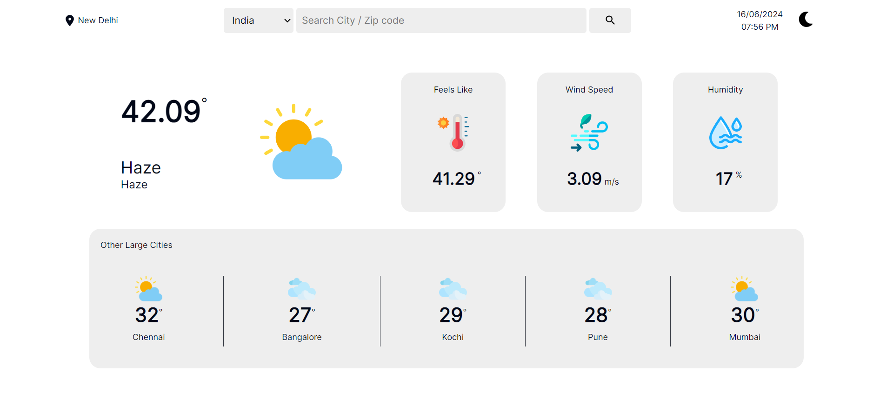

# Weather Web Application

## Project Description

This is a weather web application built to provide real-time weather information using the OpenWeatherMap API. The app is designed to be responsive, ensuring compatibility across various devices and screen sizes. The project leverages modern web technologies, offering a clean and intuitive user experience.

## Screenshotss

### Dark Mode


### Light Mode



## Technologies Used

- **HTML**: Structure of the web app.
- **CSS**: Styling of the web app.
- **JavaScript**: Core functionality and logic.
- **ReactJS**: Front-end framework for building the user interface.
- **Vite**: Next-generation front-end tooling for faster and more efficient development.
- **OpenWeatherMap API**: Source of real-time weather data.
- **Responsive Design**: Ensures compatibility and usability across different devices and screen sizes.

## Setup and Run Instructions

### Prerequisites

Before you begin, ensure you have the following installed:

- Node.js (https://nodejs.org/)
- npm or yarn (npm comes with Node.js, yarn can be installed from https://yarnpkg.com/)

### Installation

1. **Clone the repository:**

   ```bash
   git clone https://github.com/dev-saravanan/weather-webapp.git
   cd weather-webapp
   ```

2. **Install dependencies:**
   Using npm:

   ```bash
   npm install
   ```

   Or using yarn:

   ```bash
   yarn install
   ```

3. **Obtain an API key:**

   - Sign up at [OpenWeatherMap](https://openweathermap.org/) to get your API key.

4. **Set up environment variables:**
   - Create a `.env` file in the root directory of the project.
   - Add your OpenWeatherMap API key to the `.env` file:
     ```
     VITE_API_KEY=your_api_key_here
     ```

### Running the Application

1. **Start the development server:**
   Using npm:

   ```bash
   npm run dev
   ```

   Or using yarn:

   ```bash
   yarn dev
   ```

2. **Open your browser:**
   - Navigate to `http://localhost:5173` (or the URL provided in the terminal).

### Building for Production

1. **Build the project:**
   Using npm:

   ```bash
   npm run build
   ```

   Or using yarn:

   ```bash
   yarn build
   ```

2. **Serve the built project:**
   Using npm:
   ```bash
   npm run serve
   ```
   Or using yarn:
   ```bash
   yarn serve
   ```

## Known Limitations or Issues

- **API Limitations:** The OpenWeatherMap API has a rate limit for free tier users. Exceeding this limit may result in the app being unable to fetch new data temporarily.
- **Network Dependency:** The app requires an active internet connection to fetch weather data. Without internet access, the app will not function properly.

---

Thank you for using the Weather WebApp! If you encounter any issues or have suggestions for improvements, feel free to open an issue on the GitHub repository.
